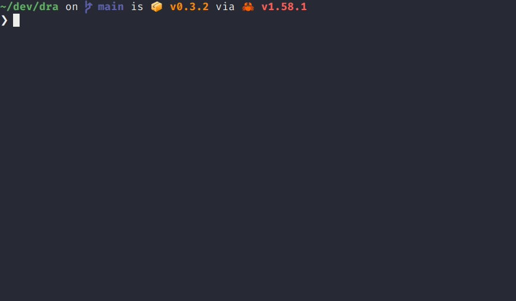

# DRA - Download Release Assets from GitHub

[](https://github.com/devmatteini/dra/actions/workflows/ci.yml)


A command line tool to download release assets from GitHub.

[Why should I use dra?](#why-should-i-use-dra) •
[Installation](#installation) •
[Usage](#usage) •
[License](#license)



## Why should I use dra?

You can do everything `dra` does with the official [GitHub cli](https://cli.github.com/).

`dra` helps you download release assets more easily:

- No authentication for public repository (you cannot use `gh` without authentication)
- [Built-in generation of pattern](#non-interactive-download) to select an asset to download
  (with `gh` you need to provide [glob pattern](https://cli.github.com/manual/gh_release_download) that you need to
  create manually).
- [Automatically select and download](#automatic) an asset based on your operating system and architecture

## Installation

`dra` is available on Linux (x86_64, armv6, arm64), macOS (x86_64, arm64) and Windows.

### Recommended

Download the prebuilt versions of `dra` for supported platforms from the [latest release](https://github.com/devmatteini/dra/releases/latest).

### Debian-based distributions

Download the latest `.deb` package from the [release page](https://github.com/devmatteini/dra/releases/latest) and
install it via:

```shell
sudo dpkg -i dra_x.y.z_amd64.deb # adapt version number
```

### On Arch Linux

Arch Linux users can install `dra` from the [community repository](https://archlinux.org/packages/extra/x86_64/dra/) using [pacman](https://wiki.archlinux.org/title/Pacman):

```shell
pacman -S dra
```

### From source

```shell
git clone https://github.com/devmatteini/dra && cd dra
make release
./target/release/dra --version
```

## Usage

- [Download assets with interactive mode](#interactive-download)
- [Download assets with non-interactive mode](#non-interactive-download)
- [Install assets](#install-assets)
- [Private repositories & rate limit](#private-repositories--rate-limit)
- [Shell completion](#shell-completion)

### Interactive download

Select and download an asset from a repository

```shell
dra download devmatteini/dra-tests
```

Select and download an asset to custom path

```shell
dra download --output /tmp/dra-example devmatteini/dra-tests

# or save to custom directory path
dra download --output ~/Downloads devmatteini/dra-tests
```

Select and download an asset from a specific release

```shell
dra download --tag 0.1.1 devmatteini/dra-tests
```

Select and download source code archives

```shell
dra download devmatteini/dra-tests
Release tag is 0.1.5
? Pick the asset to download ›
  helloworld_0.1.5.tar.gz
❯ Source code (tar.gz)
  Source code (zip)
```

### Non-Interactive download

This mode is useful to be used in automated scripts.

There are two modes to download assets: [selection](#selection) and [automatic](#automatic).

#### Selection

First, you need to generate an untagged asset name:

```shell
dra untag devmatteini/dra-tests
# output: helloworld_{tag}.tar.gz
```

Copy the output and run:

```shell
# use this command in your scripts
dra download --select "helloworld_{tag}.tar.gz" devmatteini/dra-tests
```

#### Automatic

Automatically select and download an asset based on your operating system and architecture

```shell
# you can use -a or --automatic
dra download -a devmatteini/dra-tests
```

> [!IMPORTANT]
> Since there is no naming convention for release assets,
> be aware that this mode may fail if no asset matches your system based on `dra` rules for recognizing an asset.

### Install assets

Download and install an asset (on both interactive and non-interactive modes)

```shell
dra download --install devmatteini/dra-tests
```

Supported assets that can be installed are:

- Debian packages (`.deb`)
- Tar archive with executable (`.tar.[gz|bz2|xz]`, `.tgz`, `.tbz`, `.txz`)
- Zip file with executable (`.zip`)

### Private repositories & rate limit

In order to download assets from private repositories (and avoid rate limit issues) export an environment
variable `GITHUB_TOKEN=<token>`.

Follow the official guide to create
a [personal access token](https://docs.github.com/en/authentication/keeping-your-account-and-data-secure/creating-a-personal-access-token).
The minimum set of scopes needed is: `Full control of private repositories `.

### Shell completion

Generate shell completion

```shell
dra completion bash > dra-completion
source dra-completion
```

See all supported shell with `dra completion -h`

---

For more information on args/flags/options/commands run:

```shell
dra --help
dra <command> --help
```

## Contributing

Take a look at the [CONTRIBUTING.md](CONTRIBUTING.md) guide.

## License

`dra` is made available under the terms of the MIT License.

See the [LICENSE](LICENSE) file for license details.
